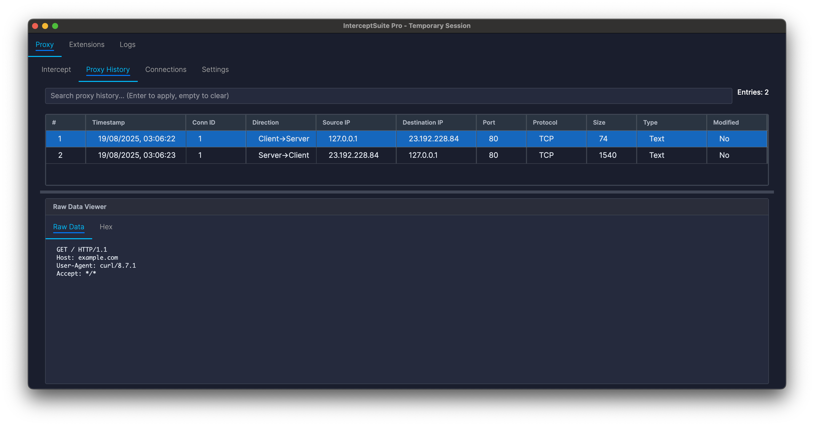
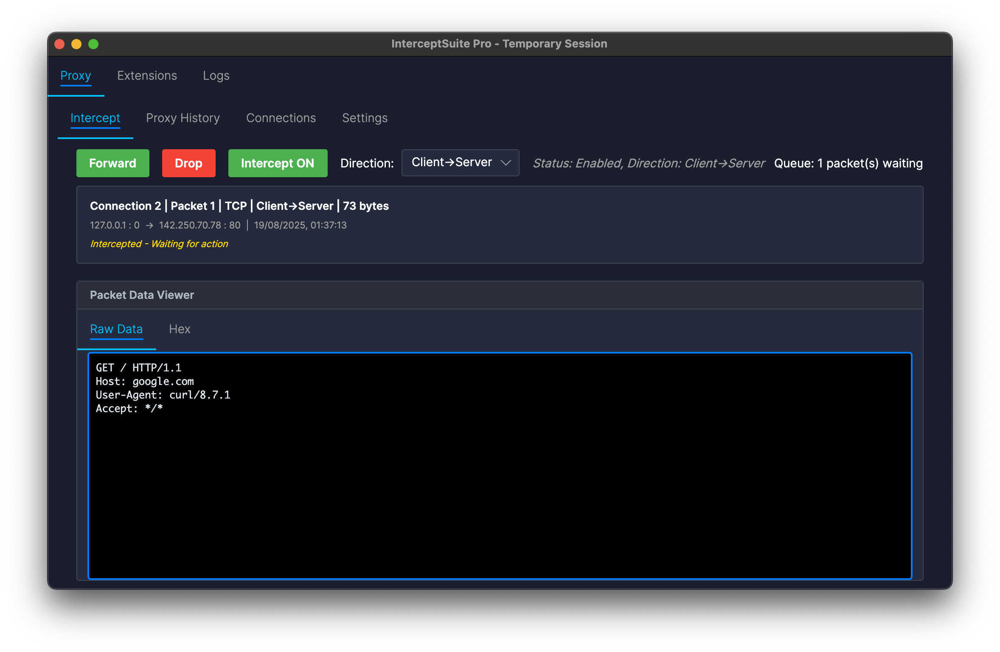
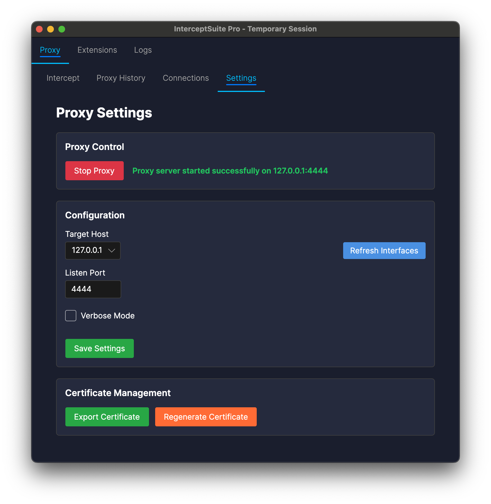
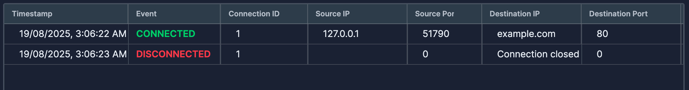

### TCP/UDP TLS/SSL Traffic MITM & Interception
*MITM Proxy for Thick Client & non-HTTP Protocol*

---

## 🌟 Overview

**InterceptSuite** is a cross-platform network traffic interception tool for comprehensive TLS/SSL inspection, analysis, and manipulation at the network level. Unlike traditional tools such as Burp Suite or ZAP that focus on HTTP/HTTPS traffic, InterceptSuite operates at the TCP/TLS layer, providing visibility into any TLS-encrypted protocol.

### 🎯 Key Capabilities

- **Protocol-Agnostic**: Intercepts TLS traffic from any application or protocol
- **Universal Interception**: Works with thick clients, custom protocols, and non-HTTP applications
- **Python Extensions**: Add custom protocol dissection capabilities tailored to your needs
- **Cross-Platform**: Native support for Windows, Linux, and macOS

## Table of Contents

- [🌟 Overview](#-overview)
- [✨ Features](#-features)
- [🚀 Getting Started](#-getting-started)
- [📖 Usage](#-usage)
- [🔧 Proxy Configuration](#-proxy-configuration)
- [🐍 Protocol Dissection & Python Extensions](#-protocol-dissection--python-extensions)
- [🤔 When to Use InterceptSuite](#-when-to-use-interceptsuite-vs-http-specific-tools)
- [🖼️ Screenshots](#️-screenshots--interface)
- [📄 License](#-license)
- [🙏 Acknowledgments](#-acknowledgments)

---

## ✨ Features

- **Protocol-Agnostic TLS Interception** – Intercept TLS/SSL traffic from any application or protocol
- **SOCKS5 Proxy Integration** – Versatile connection handling via SOCKS5 protocol
- **Real-time Traffic Analysis** – View decrypted traffic as it flows through the proxy
- **Connection Management** – Track active connections and view detailed information
- **Certificate Authority Management** – Automatic CA certificate generation and platform-specific storage
- **Traffic Manipulation** – Modify intercepted traffic before forwarding
- **High-Performance C Core** – Optimized engine for maximum speed and minimal memory footprint
- **Custom Integration** – Embed TLS interception capabilities into your applications (DyLib/So/DLL)
- **Modern GUI** – Cross-platform native performance with Avalonia .NET
- **Python Extension Support** – Add custom protocol dissection with Python plugins

> [!NOTE]
> [PRO version](https://interceptsuite.com) is available with additional features including STARTTLS support, PCAP export, and universal TLS upgrade detection.

## 🚀 Getting Started

### Prerequisites

- **Windows 10/11 (64-bit)**, **Linux (x64)**, or **macOS 13+ (Apple Silicon)**

### Installation

1. Download the platform-specific installer from the [Releases page](https://github.com/anof-cyber/InterceptSuite/releases)
   - Windows: `.exe` installer
   - Linux: `.deb` (Ubuntu/Debian) or `.rpm` (RedHat/Fedora)
   - macOS: `.pkg` installer
2. Run the installer and follow the setup wizard
3. Launch InterceptSuite from your applications menu

## 📖 Usage

### Quick Start

1. Launch InterceptSuite application
2. Start the proxy server (default: `127.0.0.1:4444`)
3. Install the generated CA certificate as a trusted root
4. Configure your client application to use the SOCKS5 proxy
5. Begin intercepting and analyzing TLS traffic

> **Important:** InterceptSuite generates a unique CA certificate on first run that must be installed as a trusted root certificate authority for TLS interception to work.

For comprehensive documentation, visit [doc.interceptsuite.com](https://doc.interceptsuite.com)

## 🔧 Proxy Configuration

Configure your client application to use the SOCKS5 proxy at `127.0.0.1:4444`.

### Platform-Specific Configuration

- **Windows** – Use Proxifier for system-wide SOCKS5 support
- **Linux** – Use ProxyCap, tsocks, Proxychains, or iptables
- **macOS** – Use Proxifier for Mac or Proxychains-ng for terminal applications

For detailed configuration instructions, see the [Documentation](https://doc.interceptsuite.com)

## 🤔 When to Use InterceptSuite vs. HTTP-Specific Tools

> [!NOTE]
> While InterceptSuite can handle HTTP/HTTPS traffic, it is **strongly recommended** to use HTTP-specific tools like Burp Suite or ZAP for web application testing. These tools provide specialized features optimized for HTTP-based protocols.

### Use InterceptSuite for:

- Non-HTTP TLS-encrypted protocols
- TCP/TLS layer traffic analysis
- Custom TLS-encrypted protocols
- Thick client applications
- Game or IoT protocols
- Protocol-specific security tools

### Use Burp Suite or ZAP for:

- HTTP/HTTPS traffic
- Web application testing
- Web security assessments
- HTTP-specific features (request repeating, vulnerability scanning, session management)

### Decision Matrix

| Scenario | InterceptSuite | Burp/ZAP |
|:---------|:--------------:|:--------:|
| Web Application Testing | Limited | ✓ |
| Mobile App API (HTTP) | Limited | ✓ |
| IoT Device Communications | ✓ | Limited |
| Desktop App (Custom Protocol) | ✓ | Limited |
| Database TLS Connections | ✓ | Limited |

## 🖼️ Screenshots & Interface

### Intercept Tab

*View and modify network packets in real-time*

### Proxy History Tab

*View all messages that have passed through the SOCKS5 proxy*

### Settings Tab

*Configure proxy server, logging, interception rules, and certificate management*

### Connections Tab

*Monitor TCP connection details and active sessions*

## 🐍 Protocol Dissection & Python Extensions

InterceptSuite does not include built-in protocol dissection by design. Instead, it provides a **Python Extension API** that allows you to write custom protocol dissection according to your specific needs.

### Why This Approach?

- **Flexibility** – Write dissectors for any protocol you encounter
- **Performance** – Load only the dissectors you need
- **Customization** – Tailor protocol parsing to your use cases
- **Community-Driven** – Share and collaborate on protocol dissectors
- **Extensibility** – Add new protocols without waiting for updates

### What's Included

- Raw decrypted traffic viewing
- TCP-level connection information
- Timestamp analysis

For documentation and examples, visit [doc.interceptsuite.com](https://doc.interceptsuite.com)

## 🤝 Contributing

Contributions are welcome:

- **Bug Reports** – Report issues on our GitHub Issues page
- **Feature Requests** – Submit enhancement suggestions
- **Pull Requests** – Check contribution guidelines before submitting
- **Documentation** – Help improve documentation and examples

## 📄 License

This project is licensed under the **GNU Affero General Public License v3.0 (AGPL-3.0)**

The AGPL-3.0 license ensures that InterceptSuite remains free and open source, while requiring that any network-based services using this code also provide their source code to users.

---

## 🙏 Acknowledgments

Built with:

- **OpenSSL** – TLS/SSL functionality and cryptographic operations
- **Avalonia .NET** – Cross-platform GUI framework
- **CMake** – Cross-platform build system

Thank you to all contributors, testers, and users who help make this project better.

---

**Secure by Design • Cross-Platform • Open Source**

